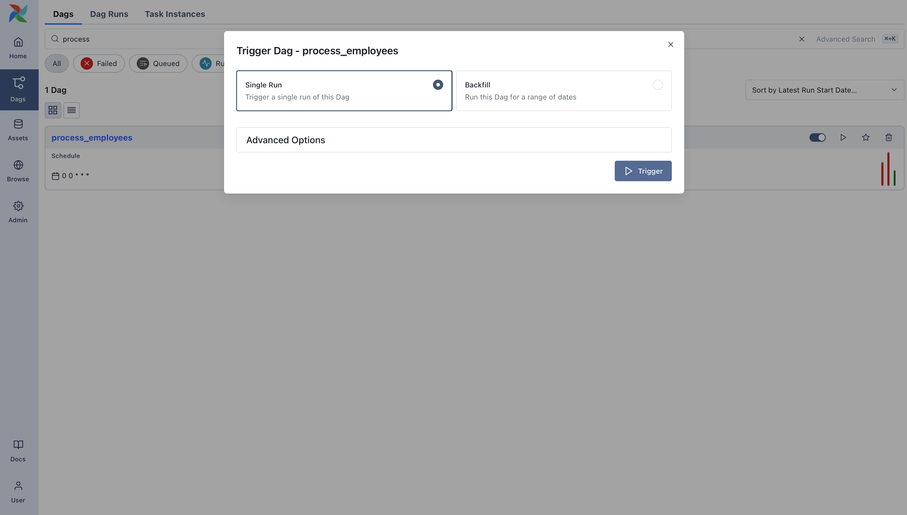
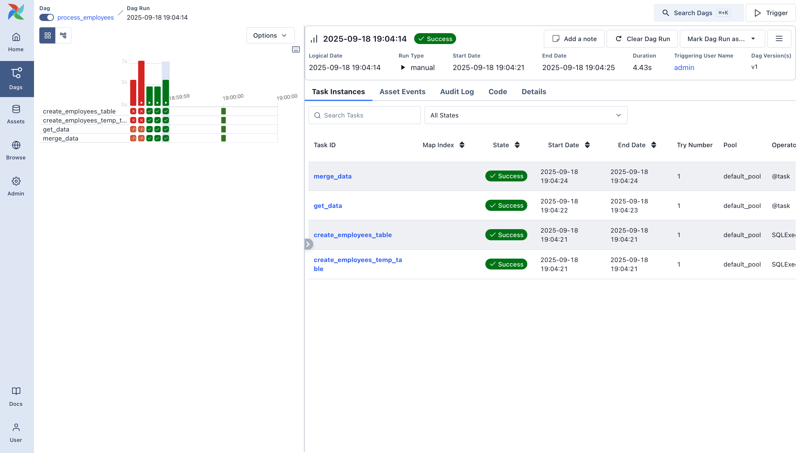

# Running Airflow within Docker

* You’ll need Docker installed to run this tutorial. We’ll be using Docker Compose to launch Airflow locally. If you need help setting it up, check out the Docker Compose quickstart guide.

* We need a working Airflow environment. Docker Compose makes this easy and safe – no system-wide installs required. Just open your terminal and run the following:

```shell
    # Download the docker-compose.yaml file
    curl -LfO 'https://airflow.apache.org/docs/apache-airflow/stable/docker-compose.yaml'

    # Make expected directories and set an expected environment variable
    mkdir -p ./dags ./logs ./plugins
    echo -e "AIRFLOW_UID=$(id -u)" > .env

    # Initialize the database
    docker compose up airflow-init

    # Start up all services
    docker compose up
```

* Once Airflow is up and running, visit the UI at `http://localhost:8080`.

* Log in with:
    * Username: `airflow`
    * Password: `airflow`

You’ll land in the Airflow dashboard, where you can trigger Dags, explore logs, and manage your environment.

# Trigger and explore your Dag

Open the Airflow UI and find the `process_employees` Dag in the list. Toggle it “on” using the slider, then trigger a run using the play button.



You can watch each task as it runs in the Grid view, and explore logs for each step.





# Reference

* Following [Initial setup](https://airflow.apache.org/docs/apache-airflow/stable/tutorial/pipeline.html#initial-setup) for [Building a Simple Data Pipeline](https://airflow.apache.org/docs/apache-airflow/stable/tutorial/pipeline.html#) tutorial